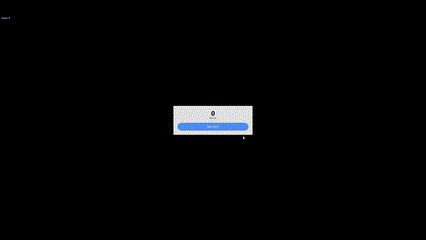

# Defense Shooter Game


[](https://app.netlify.com/sites/defense-shooter/deploys)

[](https://defense-shooter.netlify.app/)

This web application is designed for a defense shooter game using HTML5/Canvas. I created and implemented features such as shooting mechanics, enemy spawn dynamics, explosive effects, player score. Immerse yourself in the action by shooting with precision using your mouse.

## Table of Contents

-  [Folder Structure](#folder-structure)
-  [Usage](#usage)
-  [Gif](#gif)
-  [Contributing](#contributing)
-  [Dependencies](#dependencies)

## Folder Structure

-  **img:** Contains game-related assets such as gifs.
-  **js:** JavaScript files for implementing game logic and interactions.
-  **index.html:** The main HTML file that includes the Canvas element.
-  **index.js:** The entry point for the application.

## Usage

1. Clone the repository:

```bash
git clone https://github.com/HEAD0223/defense-shooter.git
cd defense-shooter
```

2. Click `Go Live` in VS Code.
3. Visit `http://localhost:5500` in your browser to experience the game.

## Gif



## Contributing

If you would like to contribute to this project, please follow these steps:

1. Fork the repository.
2. Create a new branch for your feature: `git checkout -b feature-name`
3. Commit your changes: `git commit -m 'Add some feature'`
4. Push to the branch: `git push origin feature-name`
5. Submit a pull request.

## Dependencies

-  **GSAP:** GreenSock Animation Platform for smooth and performant animations.
-  **Tailwind CSS:** A utility-first CSS framework.

Make sure to include these dependencies in your project.
